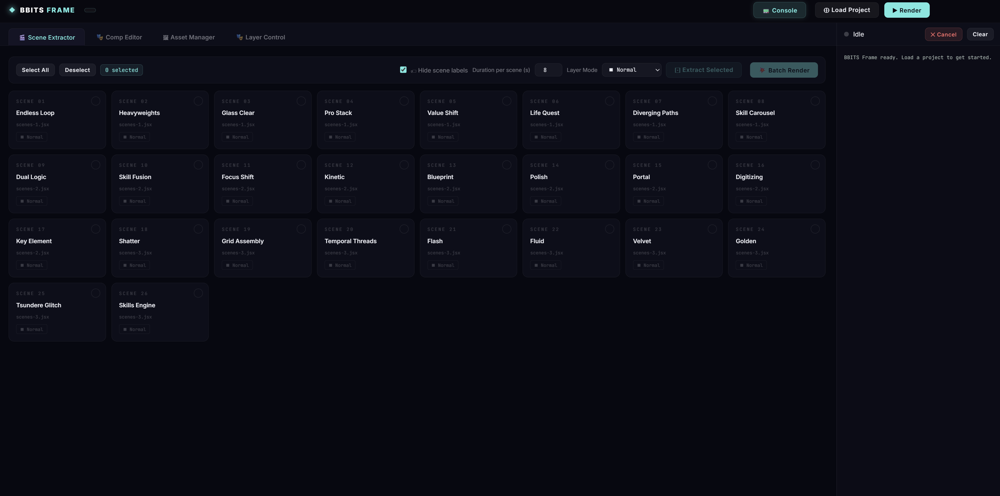
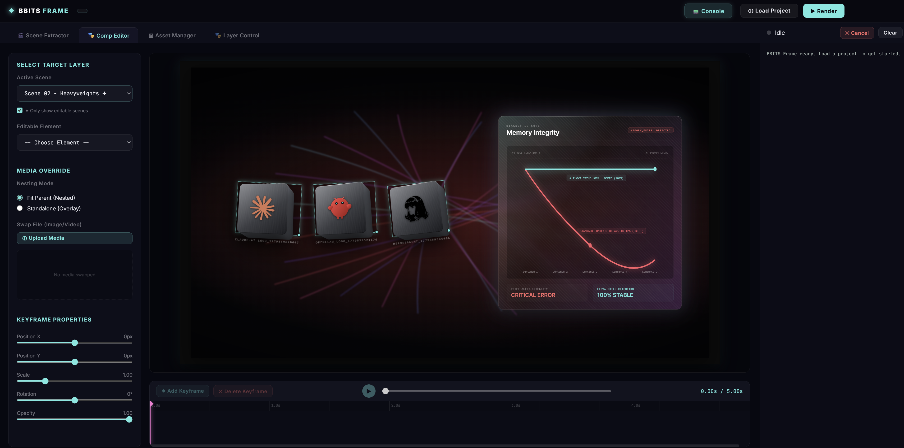
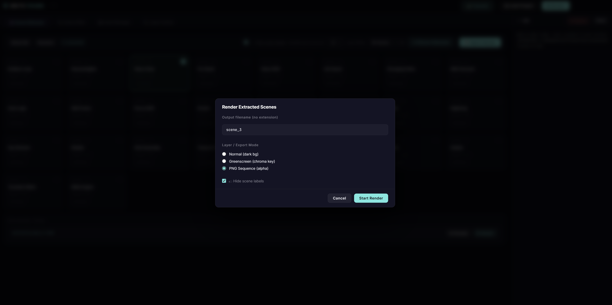

# BBits Frames

A standalone GUI dashboard tool for working with HyperFrames motion graphics scene projects.

**Works with any HyperFrames project**.





---

## Quick Start

1. Double-click **`START.bat`**
2. Browser opens at **`http://localhost:4999`** automatically
3. Click **⊕ Load Project** and paste the path to your HyperFrames project folder (e.g. `f:\projects\MyHyperFramesProject`)

---

## Features

### 🎬 Scene Extractor
- Browse all 25 scenes in a visual card grid
- Check any subset to extract just those scenes into a standalone HTML file
- **Strip HUD** toggle removes `<SceneLabel>` debug overlays from the output
- Set per-scene duration (default 8 seconds per scene)
- **Preview** the extracted HTML directly in your browser
- **Alpha Layer Export & Renders**: Support for exporting with a fully transparent background (`transparent`) or solid `#00b140` greenscreen, allowing seamless overlaying/compositing inside video editing suites like DaVinci Resolve or Premiere Pro.
- **Render** it to MP4 or transparent PNG sequence with one click

### 🎭 Comp Editor (Element Swap)
- Swap out key assets, logos, and adjust positions, scales, rotation, and opacity with keyframe control.
- > [!IMPORTANT]
  > **Note on Element Swapping**: To use the element swap features, you must first ask your AI agent to modify the corresponding scene JSX files to define the editable targets/elements.

### 🖼 Asset Manager
- See every image/video referenced across all JSX scene files
- Thumbnail preview for image assets
- **Replace** any asset by drag-and-drop uploading a new file — automatically:
  - Copies the new file to `uploads/`
  - Rewrites all matching paths in `scenes-1.jsx`, `scenes-2.jsx`, `scenes-3.jsx`
  - Saves a `.bak` backup of the original JSX before modifying
- **Restore Backup** button to undo any replacement

### 🎭 Layer Control
Set the export mode for each scene:
*   **Normal**: Standard dark background, full render
*   **Greenscreen**: Solid `#00b140` background — chroma-key over your talking-head footage in DaVinci Resolve
*   **Alpha Mode**: Perfect transparent background (`transparent`)

### 📟 Console
- Live streaming render output from `npx hyperframes render`
- Cancel render at any time
- See asset replacement and extraction events in real time

---

## Render Export Options

When rendering, choose from the render modal:
- **Normal (dark bg)** — standard MP4 with black background
- **Greenscreen (chroma key)** — MP4 with `#00b140` background, import into DaVinci and use Qualifier to key it out
- **PNG Sequence (alpha)** — frame-by-frame PNGs with transparency for maximum quality compositing in DaVinci Resolve

---

## File Structure

```
f:\BBits frames\
├── START.bat              ← Double-click to launch
├── bbits-studio.js        ← Main Node.js server (port 4999)
├── package.json
├── lib\
│   ├── scene-parser.js    ← Parses JSX to find scenes and assets
│   ├── extractor.js       ← Builds standalone HTML from selected scenes
│   ├── asset-manager.js   ← Rewrites asset paths in JSX (with .bak backup)
│   └── renderer.js        ← Streams npx hyperframes render output via SSE
└── public\
    ├── index.html         ← Full GUI shell (4 tabs)
    ├── style.css          ← Dark premium theme
    └── app.js             ← All frontend logic
```

---

## Notes

- The server watches your JSX files with `chokidar` and refreshes scene/asset data automatically when files change.
- Extracted scene HTML files are saved to `<project>/extracts/` inside your project folder.
- Rendered MP4s and PNG sequences are saved to `<project>/renders/`.
- Backups are saved as `scenes-1.jsx.bak` etc. alongside the originals.
